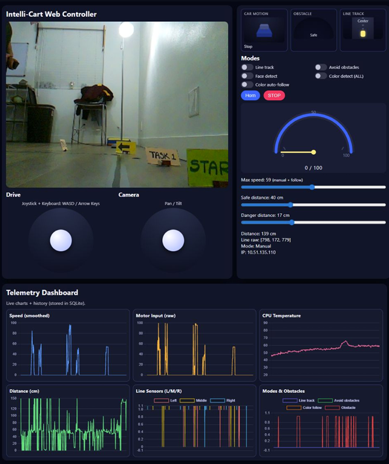
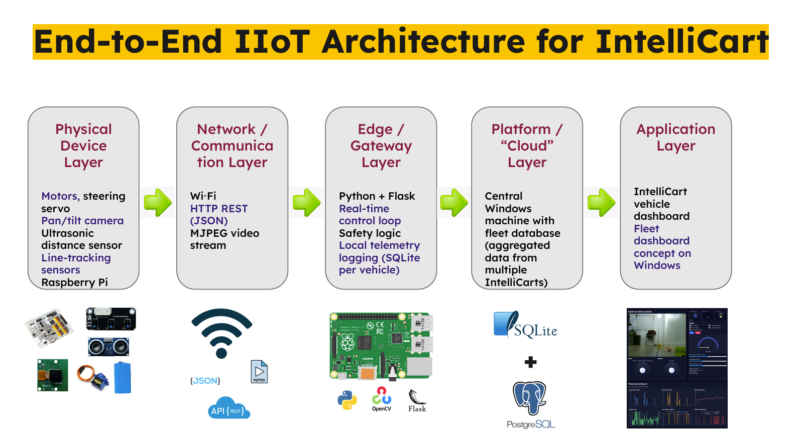

# IntelliCart: IIoT‑Enabled Smart Factory Vehicle

A Local IIoT-Based Approach to Intelligent Navigation and Obstacle Avoidance

---

## 1. Project Summary

IntelliCart is a small autonomous/remote‑controlled cart designed as a **smart factory vehicle testbed**. It demonstrates how a modern factory could monitor and control a fleet of carts over an IIoT architecture.  

Each IntelliCart runs on a Raspberry Pi and exposes a web-based controller with live video, teleoperation (joystick + keyboard), and autonomous modes such as line tracking, obstacle avoidance, and color-based following. Telemetry (speed, distance, line sensors, CPU temperature, and mode states) is logged locally on the cart and mirrored to a central PostgreSQL database on a Windows machine.  



The goal of this project is to show **end‑to‑end connectivity from physical device → edge control → local database → central fleet dashboard**, and to provide a scalable foundation for future multi‑vehicle fleet management and analytics. 

---


## 2. System Overview

IntelliCart follows a layered IIoT architecture:

- **Physical Device Layer** – RobotHat + Raspberry Pi 4, DC motors, steering servo, pan/tilt camera servos, ultrasonic distance sensor, 3‑channel line‑tracking sensor, and the Pi camera / CPU temp sensor.
- **Network / Communication Layer** – Wi‑Fi connectivity; HTTP REST (JSON) APIs for control and telemetry; MJPEG for live camera streaming.  
- **Edge / Gateway Layer (on Raspberry Pi)**  
  - Python + Flask web server  
  - Real‑time control loop (drive, steering, camera)  
  - Safety logic (safe & danger distance thresholds configurable from UI)  
  - Local telemetry logging into a **per‑vehicle SQLite DB** (1 row/sec)
- **Platform / “Cloud” Layer (Central Windows Machine)**  
  - PostgreSQL database with `vehicle_telemetry` table extended by `vehicle_id`  
  - Aggregated telemetry from multiple IntelliCarts  
- **Application Layer**  
  - **IntelliCart Web Dashboard** (vehicle‑level controller + telemetry)  
  - **Fleet Dashboard** (central, read‑only status view for all vehicles; currently tested with one IntelliCart, designed for many). 

### 2.1 Architecture Diagram




---


# Intellicart Setup Guide (Raspberry Pi)

This guide provides step-by-step instructions to install and run the Intellicart project on a Raspberry Pi.

## System Update & Dependencies

```bash
sudo apt update -y
sudo apt upgrade -y
sudo apt install git python3-pip python3-setuptools python3-smbus -y
````

## Clone the Repository

```bash
cd ~/
git clone -b project https://github.com/rushiranpise/MFG598-FInal-Project.git --depth 1
cd MFG598-FInal-Project
```

## Install Component Libraries

### Sensor-HAT

```bash
cd sensor-hat
sudo python3 install.py
cd ..
```

### Video Library

```bash
cd videolib
sudo python3 install.py
cd ..
```

### Intellicart Core

```bash
cd intellicart
sudo pip3 install . --break
cd ..
```

### Controller Module

```bash
cd controller
sudo python3 setup.py install
cd ..
```

### Sensor-HAT

```bash
cd sendorhat
sudo bash i2samp.sh
cd ..
```

## Raspberry Pi Configuration

```bash
sudo raspi-config
```

Enable I2C, SPI, Camera, and other required interfaces.

## Run the Application

```bash
sudo python3 app.py
```

---

# Intellicart Setup Guide (Windows / MAC OS --> (Server))

Copy the central_dashboard.py to any directory. 

make sure you install foloowing python packages before executing 

```bash
pip install flask psycopg2-binary
```

And then execute the dashboard with following command, 

```bash
python central_dashboard.py
```

Open in browser:

```
http://<windows-ip>:8000
```

## Project Presentation Slides

The full set of presentation slides used for explaining the IntelliCart IIoT architecture can be downloaded here:

[**IntelliCart Presentation Slides (PPTX)**](docs/IntelliCart-IIoT-Presentation.pptx)